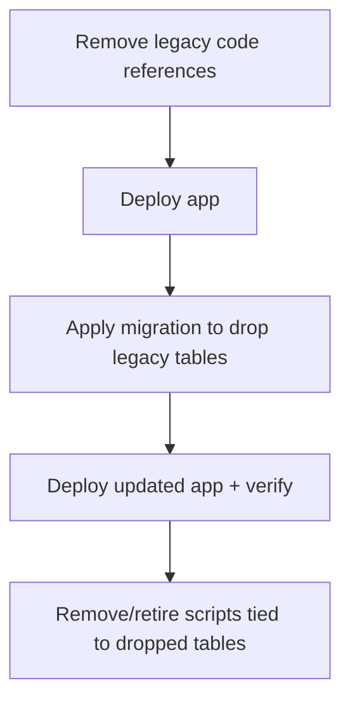

## Scope (per your request)

- Focus on **ingestion paths + DB tables**.
- **Skip script cleanup** except where a script targets a table/model we’re deleting.

## What looks legacy/unused today

- **Legacy table**: `public.games` still exists and is only used as a fallback in one route.
  - Reference: [`src/app/api/games/[appid]/route.ts`](src/app/api/games/[appid]/route.ts) falls back to `.from("games")`.
- **Job table**: `public.ingest_jobs` exists but appears **not used by the Next app**.
  - Only referenced by the script [`scripts/generate-missing-suggestions.ts`](scripts/generate-missing-suggestions.ts) (queues rows into `ingest_jobs`).
- **Current “in-use” tables/views/rpc** (do not drop):
  - `games_new`
  - `games_new_home` (materialized view)
  - `refresh_games_new_home` (rpc)
  - `collections`, `collection_games`, `collection_pins`
  - `rate_limits`

## High-level sequence (safe rollout)

1. **Remove legacy runtime codepaths first** so deploys don’t depend on legacy tables.
2. **Deploy**.
3. **Drop DB objects** via a new Supabase migration (DDL).
4. **Deploy again** (or combined deploy if your pipeline runs migrations before app starts).
5. Remove/retire any scripts that now point at dropped tables.

## Concrete tasks

### 1) Remove legacy ingestion/lookup path

- Update [`src/app/api/games/[appid]/route.ts`](src/app/api/games/[appid]/route.ts)
  - Delete the fallback query to `.from("games")`.
  - Adjust error handling accordingly (if no `games_new` row, return 404).
- Grep for any other `from("games")` usage; keep the codebase strictly `games_new`.

### 2) Drop legacy tables (Supabase migration)

- Add a new migration in [`supabase/migrations/`](supabase/migrations/) that:
  - Drops `public.ingest_jobs`.
  - Drops `public.games`.
- Notes for correctness:
  - Use `DROP TABLE IF EXISTS public.ingest_jobs CASCADE;` and `DROP TABLE IF EXISTS public.games CASCADE;` (policies/triggers/indexes depend on these tables).
  - Confirm no FK references exist (current FKs point to `games_new`, so should be fine).

### 3) Script cleanup (only because table is removed)

- Retire or delete [`scripts/generate-missing-suggestions.ts`](scripts/generate-missing-suggestions.ts)
  - It queues into `ingest_jobs`; once the table is dropped, it will not work.
  - Optional replacement: if you still want this workflow, rewrite it to call your existing **server-side auto-ingest path** (`autoIngestMissingGames` in `src/lib/ingest.ts`) or to just hit `/api/games/[appid]/suggestions/refresh` without queueing.
- Leave the other scripts alone since they target current endpoints/tables.

### 4) Verification checklist

- Code-level
  - Ensure no remaining `.from("games")` and no `.from("ingest_jobs")` outside scripts.
- Runtime
  - Hit `GET /api/games/:appid` for a known existing `games_new` row.
  - Hit `GET /api/games/:appid` for a missing id and confirm 404.
- DB
  - Confirm tables removed from schema.
  - Confirm `games_new_home` refresh still works (`refresh_games_new_home` rpc).

## Rollback strategy

- If something unexpectedly relied on legacy tables:
  - Revert the app code commit (restores fallback).
  - Revert migration by restoring the dropped tables from prior schema snapshot/backups (or re-run the old migrations that created them).
