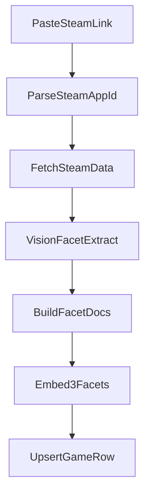

# MVP: Home list + Game detail w/ 3 facet similarity lists

## Scope (per your latest note)

- **In**
- Paste Steam link → ingest game
- Store 3 facet embeddings: **Aesthetics**, **Gameplay**, **NarrativeMood**
- **Home page** shows a plain text list of ingested games
- Clicking a game opens **detail page** with header + **three related-game lists** (one per facet)

We’ll still keep the ingestion pipeline modular so later you can add graph-building and additional aggregation providers.

## AI integration (Gateway-only, provider/model)

- **Only execution path**: AI Gateway (no direct provider calls)
- **Model id format**: `provider/model`
- Vision: `openai/gpt-4o-mini` (or your preferred)
- Embeddings: `openai/text-embedding-3-small`

### Files

- `src/lib/ai/gateway.ts`
- Creates a single AI SDK client configured to the gateway (`AI_GATEWAY_BASE_URL`, `AI_GATEWAY_API_KEY`)
- Validates model id strings match `^[a-z0-9_-]+/[A-Za-z0-9._-]+$`

## Ingestion pipeline (modular provider pattern)

### Providers (initial set)

- `SteamStoreProvider`: `appdetails` (name/desc/header/screenshots)
- `SteamReviewsProvider`: review summary counts/ratings
- `SteamTagsProvider`: initial “rich tags” source (e.g. store page tags extraction); swap-in SteamSpy later
- `VisionFacetExtractor`: multimodal call that returns structured JSON (via `generateObject` or similar) with the 3 facets:
    - `aesthetics`: description of art style, color palette, and visual perspective.
    - `gameplay`: description of core mechanics, player perspective, and loop.
    - `narrativeMood`: description of theme, atmosphere, and story tone.

## Supabase schema (simple 1-table for 3 facets)

Enable `vector` and create:

- `games`
- `id bigint primary key` (Steam AppID)
- `name text not null`
- `description text`
- `header_image text`
- `screenshots jsonb` (array of urls)
- `tags jsonb` (tag -> weight)
- `review_summary jsonb`
- `aesthetic_text text`
- `gameplay_text text`
- `narrative_text text`
- `aesthetic_embedding vector(1536)`
- `gameplay_embedding vector(1536)`
- `narrative_embedding vector(1536)`
- `vision_model text` (`provider/model`)
- `embedding_model text` (`provider/model`)
- timestamps
- `ingest_jobs` (recommended for visibility/retries)
- `id uuid pk`
- `steam_url text`
- `steam_appid bigint`
- `status text` (`queued`|`running`|`succeeded`|`failed`)
- `error text`
- timestamps

### Indexes

- Vector index on each embedding column (`aesthetic_embedding`, `gameplay_embedding`, `narrative_embedding`)
- btree index on `name`

> Note: embedding dimension is fixed by the chosen model. We’ll default to **1536** (text-embedding-3-small). If you switch embedding model dimension later, we’ll add a migration.

## Similarity queries (3 lists)

On the game detail page, we’ll compute 3 neighbor lists independently:

- **Aesthetics similar**: kNN over `aesthetic_embedding`
- **Gameplay similar**: kNN over `gameplay_embedding`
- **Narrative/Mood similar**: kNN over `narrative_embedding`

Implementation options:

- **Option A (recommended MVP)**: 3 Supabase RPC functions (or 1 function with a `facet` param) that returns `[{appid,name,header_image,similarity}]`. Use a configurable `threshold` (e.g., 0.7) to ensure only relevant matches are shown.
- **Option B**: server route that fetches seed vectors then runs SQL queries via Supabase.

We’ll return `similarity = 1 - cosine_distance` so the UI can show a simple score. We will also implement a "global similarity" view later if needed by averaging the three scores.

## Next.js routes + UI

### Routes

- `src/app/api/games/ingest/route.ts`
- POST `{ steamUrl }`
- Runs ingestion pipeline and upserts `games`
- Writes `ingest_jobs` status as it runs
- `src/app/api/games/[appid]/route.ts`
- GET game header data
- `src/app/api/games/[appid]/related/route.ts`
- GET related games for each facet (either all 3 at once or per facet)

### UI

- `src/app/page.tsx`
- Steam URL input
- Plain text list of ingested games (name + appid)
- `src/app/games/[appid]/page.tsx`
- Header (name, image, tags)
- Three sections below:
    - Aesthetics similar
    - Gameplay similar
    - Narrative/Mood similar

## Supabase setup workflow

- Use Supabase CLI (or MCP) to:
- init/link project
- apply migrations
- configure env vars for service role + gateway

## Implementation todos

- `supabase-schema`: Add migrations for pgvector + `games` + `ingest_jobs` + vector indexes.
- `ai-gateway-client`: Implement AI SDK client bound to gateway, with `provider/model` validation.
- `steam-providers`: Implement URL→appid parser + store/reviews/tags providers.
- `facet-pipeline`: Implement vision facet extraction + doc builder + embedding + upsert.
- `similarity-endpoints`: Add related-by-facet queries and wire to detail page.
- `ui-pages`: Replace landing page with input + text list; add detail page with 3 lists.