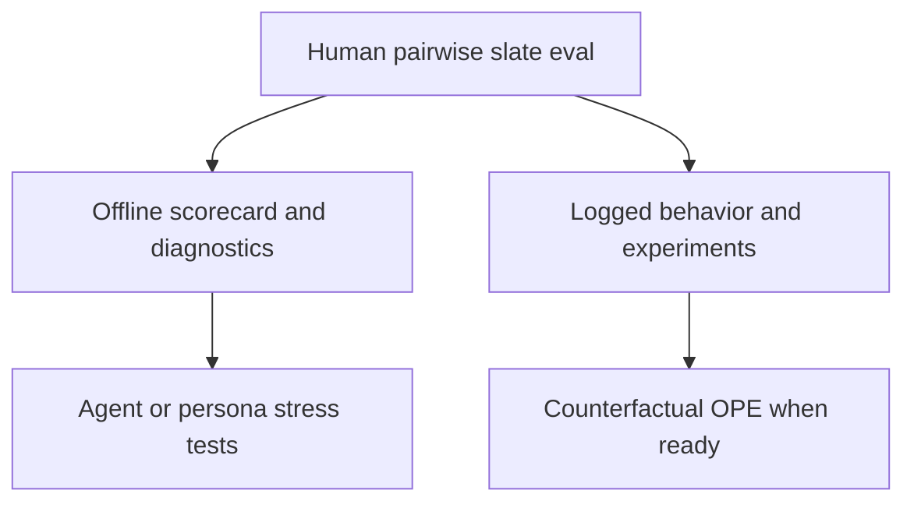

# Recommendation evaluation framework

This document is the canonical bridge from **today’s** IndieFindr matching (`games like X` from a seed game) to **planned** taste-driven and agent-assisted discovery. It exists so we can improve the system with a shared definition of “good” instead of a single proxy metric.

**Related docs**

- [Case study: adaptive game suggestion system](./case-study-suggestion-system.md) — how the current pipeline evolved and why multi-strategy consensus exists.
- [Research briefs](./research/README.md) — drift-resistant external references (citations, limits, IndieFindr takeaways).

---

## 1. Problem framing

### Why one metric is not enough

Taste is **multi-dimensional**: vibe, mechanics, pacing, difficulty, aesthetic, and “who this is for” rarely line up on a single axis. Optimizing only one thing (e.g. tag overlap, genre match, or click rate) tends to:

- Collapse nuance into obvious, safe neighbors.
- Reward popularity or surface-level keywords over feel.
- Hide failures for niche seeds or minority “facets” inside a good average.

Strong recommendation teams use an **eval stack**: human judgment for fuzzy goals, offline diagnostics for fast iteration, stress tests for edge cases, and online experiments when causal signals exist.

### What IndieFindr should evaluate today

The production path is **seed game → ranked slate of similar games**, not a full user-item recommender with a learned profile.

- Pipeline: `suggestGamesVibe` in [`src/lib/suggest.ts`](../src/lib/suggest.ts) — type detection, three parallel strategies (vibe, mechanics, community), consensus merge, DB/Steam validation, type-aware curation.
- Surface: game detail “Games like {title}” in [`src/app/games/[appid]/suggestions-section.tsx`](../src/app/games/[appid]/suggestions-section.tsx), backed by `game_suggestions` rows.

So the primary eval unit is:

**`source game (seed) → top-K suggested games + short explanations`**

Do not pretend we already have user-level calibration (distribution of interests across a profile) in the same way Spotify or Netflix do until we **log** user-facing recommendation events and optionally model users.

---

## 2. Current state

### What the system is

| Piece | Role |
|--------|------|
| `detectGameType` | Assigns a `GameType` and vibe words; known art devs fast-path to avant-garde. |
| Three strategies | Perplexity-backed prompts: vibe, mechanics, community — different notions of “similar.” |
| `combineWithConsensus` | Same title across strategies increases confidence (consensus count). |
| `validateSuggestions` | Resolve titles to Steam app IDs via DB + Steam search; drop unverified. |
| `curateWithAI` | Final top-N with type-aware guidance and preference for high-consensus candidates. |

Outputs include structured `VibeResult`: suggestions, per-stage timing, and stats (e.g. `highConsensus`, `unverified`).

Persistence: [`game_suggestions`](../supabase/migrations/20260109000001_add_game_suggestions_table.sql) stores `source_appid`, `suggested_appid`, `reason`. Ingest may also maintain `games_new.suggested_game_appids` — when analyzing, be explicit which source you use.

### What we can evaluate now

- **Slate quality** for a fixed seed: relevance, constraint fit, discovery value, redundancy.
- **Explanation quality**: does the `reason` match the pair (faithfulness), or is it generic?
- **Internal diagnostics** (leading indicators, not user happiness): consensus distribution, verified vs unverified counts, latency/cost, run-to-run stability.
- **Tag-level guardrails** (optional offline): [`src/lib/utils/steamspy.ts`](../src/lib/utils/steamspy.ts) exposes tag similarity and vibe-conflict checks (e.g. horror vs wholesome). Not a substitute for human judgment; useful for automated red flags.

### What not to overfit to yet

- **Raw CTR alone** as “match quality” — clicks mix position, curiosity, and misleading thumbnails/titles.
- **User-profile calibration** (matching a list to a full taste distribution) until we have real user signals and surfaces that support it.
- **Counterfactual / OPE (IPS, SNIPS, DR)** until we log **impressions** (what was shown, in what order) and ideally some **exploration** or propensity estimates.

---

## 3. Future state (direction)

This section is **directional**, not a commitment to ship order.

### Likely near-term

- **Taste briefs**: structured user intent (must-haves, deal-breakers, time budget, mood) instead of only a single seed game.
- **Richer signals**: explicit feedback (save, dismiss, “not this vibe”), or lightweight preference elicitation.

### Longer-term

- **Agent-assisted matching**: multi-turn clarification, then slate generation — evaluation must cover **task success** and **stability**, not only the final list.

### How eval evolves

| Phase | Focus |
|--------|--------|
| Seed-only | Seed → slate rubrics, pairwise slates, offline scorecard. |
| Seed + brief | Brief-to-slate **constraint satisfaction** and facet coverage; still pairwise where possible. |
| Personalized / agent | Add session-level metrics, regret vs oracle where defined, simulator calibration against real logs. |

---

## 4. Evaluation stack

Use **layers**. Higher layers do not replace lower ones.

### Layer A — Human judgment (ground truth for fuzzy quality)

- **Method**: Prefer **pairwise comparisons** of two slates for the **same seed** (or same brief): “Which slate better matches the intent?”
- **Why**: Relative judgments are more reliable than absolute 1–5 scores for taste.
- **Axes** (example): Fit, constraint satisfaction, discovery quality, slate coherence, explanation faithfulness.
- **Use**: Model bakeoffs, prompt changes, reranker changes — anything that changes the slate.

### Layer B — Offline scorecard (fast regression)

Track a **small scorecard**, not one number:

- Pairwise win rate vs baseline (from human labels).
- Hard **constraint violation** rate (when eval cases define must-nots).
- Redundancy / near-duplicate slates.
- Popularity skew (e.g. over-indexing on mega-hits for indie seeds).
- Coverage by **seed type** (avant-garde, cozy, competitive, narrative, action, mainstream).
- Internal diagnostics: verified rate, high-consensus rate, latency, cost.

### Layer C — Agent / persona stress tests (failure finding)

- **Role**: Find edge cases, regressions, and “obviously wrong” slates at scale.
- **Not** a replacement for humans: agents can game rubrics and drift from real players.
- **Practice**: Fixed persona specs, fixed tasks, versioned judge prompts, periodic human spot-checks on a sample.

### Layer D — Logging and online experiments (causal, when ready)

- Log **impression-level** data: seed, candidate set or rank, surface, timestamps — before trusting click-only metrics.
- Run A/B or phased rollouts on **downstream success** proxies (e.g. click through to detail, outbound to store, return visits) with **guardrails** (dissatisfaction, diversity floors, latency).
- **Counterfactual evaluation** (IPS / SNIPS / DR): consider only after logging supports propensities or controlled exploration; see [Eugene Yan on counterfactual evaluation](https://eugeneyan.com/writing/counterfactual-evaluation/).

---

## 5. Phased roadmap

### Now

- Build a **gold set** of seeds (stratify by `GameType` and known failure modes from the case study).
- Define a **pairwise rubric** and run small annotation batches.
- Track an **offline scorecard** for every change that affects retrieval or ranking.

### Next

- Add **persona/task** stress tests (structured briefs, not vague “roleplay a user”).
- Automate **tag conflict** and redundancy checks where helpful.
- Tie internal diagnostics to release gates (e.g. max unverified rate, max latency).

### Later

- Instrument recommendation **impressions** and key clicks.
- Introduce exploration if needed for unbiased learning.
- Add **OPE** as a pre-screen for online tests when data supports it.
- Expand eval to multi-turn flows when the product does.

---

## 6. Appendices

### Appendix A — Eval case template (seed game)

Use one row per eval case; version in git or a spreadsheet.

| Field | Description |
|--------|-------------|
| `case_id` | Stable id, e.g. `seed_12345_whimsical_adventure` |
| `source_appid` | Seed Steam app id |
| `expected_game_type` | From product or adjudicator (avant-garde, cozy, …) |
| `must_match` | Bullet list: facets the slate should reflect |
| `must_not` | Deal-breakers (e.g. wrong subgenre, tone clash) |
| `acceptable_surprise` | What “good unexpected” looks like for this seed |
| `notes` | Links to case study, past bugs, screenshots |

### Appendix B — Pairwise judging rubric (example)

For the **same seed**, compare Slate A vs Slate B. Pick a winner or tie; optional short justification.

| Axis | Question |
|------|----------|
| **Core fit** | Does the slate match the seed’s core feel and intent? |
| **Constraints** | Are must-nots violated? Are must-haves satisfied? |
| **Discovery** | Good novelty without being random or off-brand? |
| **Coherence** | Does the list feel intentional, not redundant or noisy? |
| **Explanations** | Do reasons match the pair, or feel generic / wrong? |

Optional 0–2 scale per axis if you need aggregates; still prefer **pairwise winner** for headline metrics.

### Appendix C — Persona / task template (stress tests)

| Field | Description |
|--------|-------------|
| `persona_id` | Stable id |
| `task` | One paragraph: what the user wants, constraints, anti-goals |
| `success_criteria` | Checkable outcomes (e.g. “no roguelike”, “must include at least one short-session pick”) |
| `oracle_notes` | Optional: example games that would be acceptable (not always required) |

Run the same tasks across model versions; humans audit a fixed sample.

### Appendix D — Example scorecard (per run or per release)

| Metric | What it measures | Notes |
|--------|-------------------|--------|
| `pairwise_win_rate_vs_baseline` | Human preference | Primary when labels exist |
| `constraint_violation_rate` | Hard failures | Should trend to zero on labeled cases |
| `redundancy_rate` | Near-duplicate suggestions in a slate | |
| `popularity_skew` | e.g. median SteamSpy owners of suggestions | Guardrail for indie seeds |
| `coverage_by_seed_type` | Performance slices | Catch “average good, niche bad” |
| `verified_suggestion_rate` | Resolved app ids | From `VibeResult` / DB |
| `high_consensus_rate` | Strategies agree | Diagnostic, not user-quality |
| `p95_latency_ms` | Cost and UX | |
| `cost_per_slate_usd` | Budget | If tracked |

### Appendix E — Pass / fail guardrails (example)

Tune thresholds to your product; treat as starting points.

- **Ship blocker**: any increase in constraint violations on the gold set vs baseline.
- **Investigate**: large regression in pairwise win rate or spike in redundancy / popularity skew for `avant-garde` or `cozy` slices.
- **Diagnostic only**: small changes in consensus count without human label movement — do not treat as user-facing win.

---

## References (external)

Do not rely on this section alone for citations. Use **[`docs/research/`](./research/README.md)** for stable identifiers (DOI, arXiv), limits of each line of work, and how we apply them.

| Topic | Brief |
|-------|--------|
| Calibration, multi-facet interests | [`research/calibration-multi-facet-recommenders.md`](./research/calibration-multi-facet-recommenders.md) |
| Counterfactual / OPE (IPS, SNIPS, support) | [`research/counterfactual-off-policy-evaluation.md`](./research/counterfactual-off-policy-evaluation.md) |
| Behavioral / slice testing (RecList) | [`research/behavioral-testing-reclist.md`](./research/behavioral-testing-reclist.md) |
| Industry: signals, satisfaction, interleaving, page sim | [`research/industry-ranking-and-experimentation.md`](./research/industry-ranking-and-experimentation.md) |

---

## Key files in this repo

| File | Purpose |
|------|---------|
| [`src/lib/suggest.ts`](../src/lib/suggest.ts) | `suggestGamesVibe`, strategies, consensus, validation, curation |
| [`src/lib/actions/suggestions.ts`](../src/lib/actions/suggestions.ts) | Persist suggestions to `game_suggestions` |
| [`src/app/games/[appid]/suggestions-section.tsx`](../src/app/games/[appid]/suggestions-section.tsx) | UI surface for similar games |
| [`src/lib/utils/steamspy.ts`](../src/lib/utils/steamspy.ts) | Optional tag similarity / vibe conflict for offline checks |
| [`docs/case-study-suggestion-system.md`](./case-study-suggestion-system.md) | Historical context and experiment lessons |
